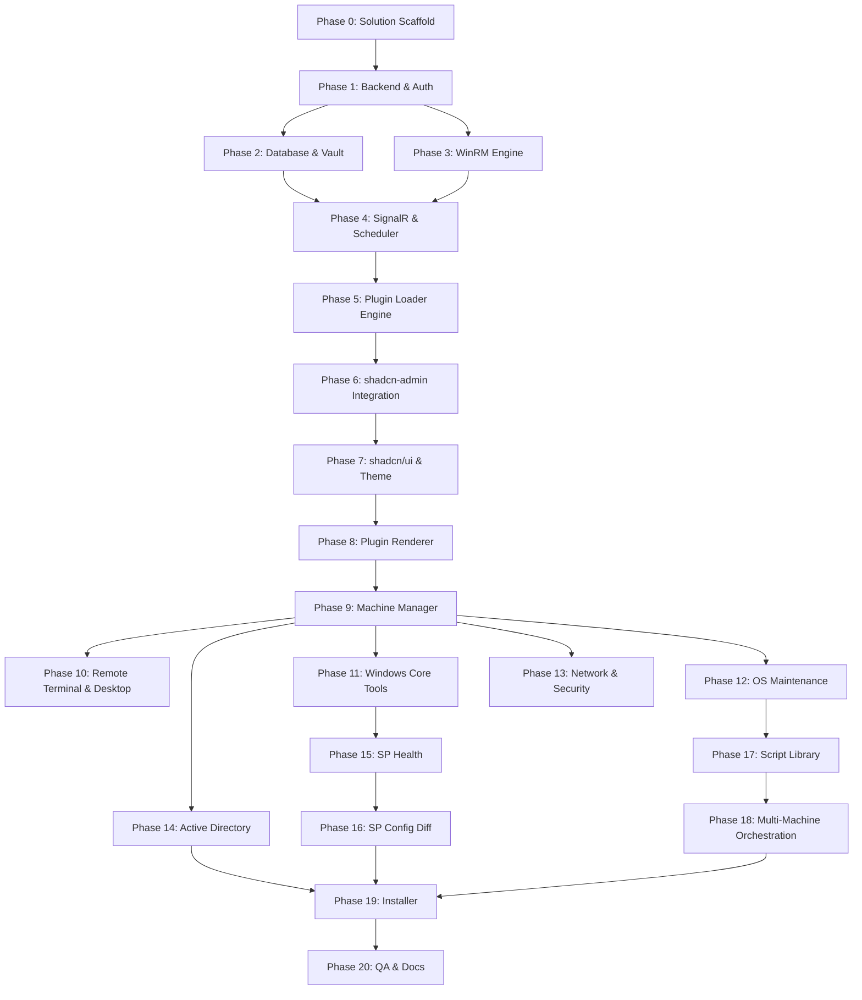

# NEXUS V2 — Dependency Map

## Phase Dependencies

Execution must happen sequentially within Phase Groups.

```mermaid
graph TD
    %% Group 1: Core Infrastructure
    P0[Phase 0: Solution Scaffold] --> P1[Phase 1: Backend & Auth]
    P1 --> P2[Phase 2: Database & Vault]
    P1 --> P3[Phase 3: WinRM Engine]
    P2 --> P4[Phase 4: SignalR & Scheduler]
    P3 --> P4
    P4 --> P5[Phase 5: Plugin Loader Engine]

    %% Group 2: Frontend Foundation
    P5 --> P6[Phase 6: shadcn-admin Integration]
    P6 --> P7[Phase 7: shadcn/ui & Theme]
    P7 --> P8[Phase 8: Plugin Renderer]

    %% Group 3: Core Plugins
    P8 --> P9[Phase 9: Machine Manager]
    P9 --> P10[Phase 10: Remote Terminal & Desktop]
    P9 --> P11[Phase 11: Windows Core Tools]
    P9 --> P12[Phase 12: OS Maintenance]
    P9 --> P13[Phase 13: Network & Security]
    P9 --> P14[Phase 14: Active Directory]

    %% Group 4: Exclusives
    P11 --> P15[Phase 15: SP Health]
    P15 --> P16[Phase 16: SP Config Diff]
    P12 --> P17[Phase 17: Script Library]
    P17 --> P18[Phase 18: Multi-Machine Orchestration]

    %% Group 5: Delivery
    P14 --> P19[Phase 19: Installer]
    P16 --> P19
    P18 --> P19
    P19 --> P20[Phase 20: QA & Docs]
```
